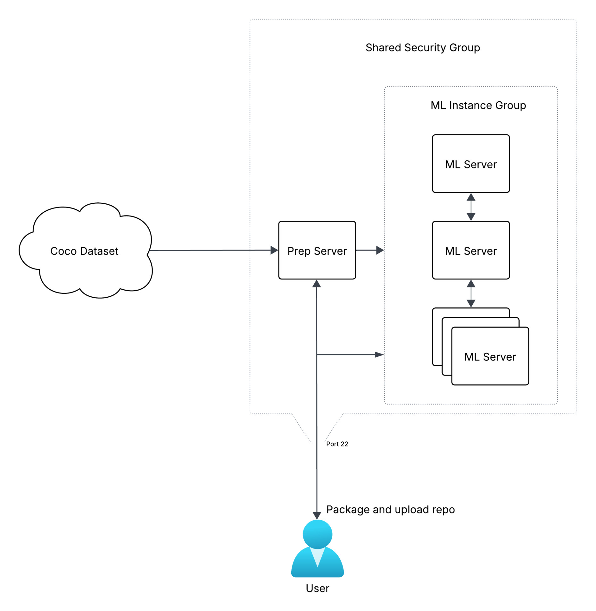

<div align="center">
<h2>YOLOv9001</h2>
<h5>SOTA QA INT8 friendly model for edge devices</h5>
<h6>Repo is work in progress</h6>
</div>


A bastardized implementation of:

[YOLOv9: Learning What You Want to Learn Using Programmable Gradient Information](https://arxiv.org/abs/2402.13616)

[YOLOv6: A Single-Stage Object Detection Framework for Industrial Applications](https://arxiv.org/abs/2209.02976)

[YOLOv6+: simple and optimized object detection model for INT8 quantized inference on mobile devices](http://dx.doi.org/10.1007/s11760-025-04234-0)

And some other cool stuff I made myself

### TOC
- [It's Over 9000](#its-over-9000)
  - [Preface](#preface)
    - [There Can Only be One](#there-can-only-be-one)
    - [License](#license)
  - [I Need a Job (A Jimmy Wales Style Plea)](#i-need-a-job-a-jimmy-wales-style-plea)
- [Performance](#performance)
- [Usage](#usage)
  - [Caveats](#caveats)
  - [Local](#local)
  - [DDP Terraform Infrastructure for AWS](#ddp-terraform-infrastructure-for-aws)
    - [Phases](#phases)

# It's Over 9000
## Preface
This doesn't have a paper. But this is a highly distinct and custom "yolo" implementation. Sometimes I'm reading these papers and it's like take it easy steinbeck just tell me how it works. It's a Qilin. It's got a bunch of parts from other model architectures and it brings it together to create a nano+ model that is focused on full end to end int8 compatibility specifically for edge devices. 

* From yolov6, I implemented the the general backbone architecture, opting for QARepVGGBlockV2. The csp and sim style sppf pooling mechanisms of yolov6 are replaced with a QA GEM SPPF hybrid that I made myself.
* From the yolov6+ paper (they don't have code) I added RepBlockAdd, and the Regression normalization techniques
* From yolov9 I use the dual head architecture, with customized QARepNCSPELAN layers, and some other quant friendly replacements including a Regression normalized detection head.

See: `./toolchain/models/detect/yolov9001-np.yaml`

### There Can Only be One
At this time, this repo is focused on building the best performing single sized fully quantizable model on the planet. I'm also running out of time and money, and this stuff takes a lot of time and horse power to train.

### License
This *should* be proper GPL. Ultralytics went back and added some AGPL headers to some files etc. All of this work should be based on yolov5/yolov9, pre AGPL.

## I Need a Job (A Jimmy Wales Style Plea)
[](https://github.com/rlewkowicz/yolov9001)

I build cool things. If you use this, tell your boss to give me a job:

[HireRyan.Today](https://HireRyan.Today)

[Ryan@HireRyan.Today](mailto:Ryan@HireRyan.Today)

I can pass most leet code easies, if not all if you give me a month, I used to practice. LLMs help me a lot now. I don't know what that means. If I can create outcomes, does it matter? You can't just say make me a new YOLO architecture. This is a highly custom and unique implementation. I clearly can understand architectures and tools chains. I can see some of the math (idk how to describe it) even if I couldn't write an equation to save my life. I can manage your ML infra at a minimum. I am not a dumb man. I don't want to go work grinding tickets in some slop operations chop shop. But I don't have pedigree and I don't have prestige so I get boxed out of what I want to do by capital institutions, because everything is an appeal to authority. There is no real meritocracy anymore. There gating mechanisms in place are designed to prevent me from thriving. This is the application. This is the Resume. Don't fire trite arbitrary gating nonsense at me please. Lets just do the culture vibe check and call it a day. Despite this tone here, I am jovial and goofy. 

Or if you're feeling philanthropic, you could change my life:

https://www.amazon.com/hz/wishlist/ls/U5Q5QWNT0NK5

It allows me the pursuit of the mind.

# Performance
Many of the performance metrics are misleading. Most models do not support true int8 quantization. They quantize where possible and context switch to float when int8 optimization is not available. This obfuscates the true performance of these models on resource constrained hardware. The following benchmarks are run on a RK3588.

# Usage

## Caveats
This is different than the yolo toolchains you are used to, even if it's based on the same code. This is based on yolov9, which is based on yolov5 (and maybe six, there was bits in there). There was a lot of dead code, and it was rough. Half the hyps don't even work with non anchored models. I'm working on cutting out the auto loader, only onnx export is supported. There's no NMS or post processing built into the model (generally not int8 friendly).

## Local

## DDP Terraform Infrastructure for AWS
Requirements: `terraform`, `jq`, `aws-cli`

Located in the `terraform` folder is infrastructure designed to facilitate DDP training. You have to have the quota for whatever instances you select. It uses the new DLAMI amis, so you have to use the newer G and P instances. Also, it wont tell you what is actually available so it will just sit at creating if AWS does not actually have the capacity but there will be no error. You can use `terraform/find_instance.py c8gn.8xlarge g5.xlarge` to find compatible AZ's. The default is ~31/HR. This was my first go with DDP. You will find it does not scale linearly. 8x horsepower will give you ~3x overall training speed etc.

```
cd terraform
terraform destroy -auto-approve -parallelism=50 && \
terraform apply -auto-approve -parallelism=50 && \
ssh -o StrictHostKeyChecking=no -o UserKnownHostsFile=/dev/null -t \
ubuntu@$(terraform output -json mlserver_public_ips | jq -r '.[0]')
```
The setup is all automatic. It's designed to minimize the amount of time the expensive GPU instances are online. You can scale to as many nodes as you have quota for, and yolov9001 will auto negotiate and start DDP. It handles batch size, master node, and node count. If you have one server with multiple gpu, it will set that up, if you have multiple servers with multiple GPU (or one), it will set that up. It does expect all instances to be of the same type.



### Phases
1. Prep
   * Spin up a jump server with a 15 gig pipe
   * Upload the yolov9001 repo from your localhost
   * Download coco at aggressive speeds
   * Package the final blob to be served from a high performance nginx
2. ML Servers (All servers will do this simultaneously, ML servers will not spin up until prep is done)
   * Download the blob and unpackage it. There's magic logic that looks for total ram first, and nvme second. If either are sufficient, it will create a ram disk, or move the ubuntu home dir to the nvme.
   * Install python deps. It will download and install miniconda plus uv. It will use uv pip to install deps. This causes the deps to install VERY fast.
   * Launch DDP training in a screen (ddptrain) automatically on all hosts using all available GPUS per host.